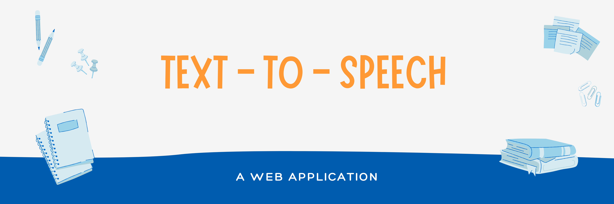

<h2> 🤖 TEXT TO SPEECH </h2>
Basically, The <a href="https://ajaiqmar.github.io/TEXT-TO-SPEECH/">Text To Speech</a> 🤖 Application is a Web application which is built on Speech Synthesis API provided by the web. Just a Text to Speech converter which just speaks the word typed in the text box provided. 

<h2> 📱TECHNOLOGY STACK </h2>

